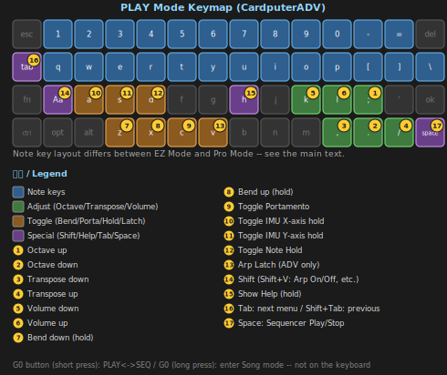
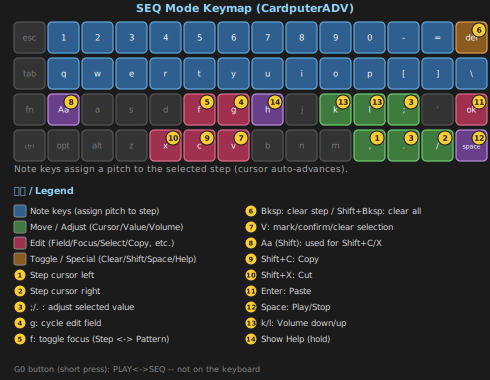
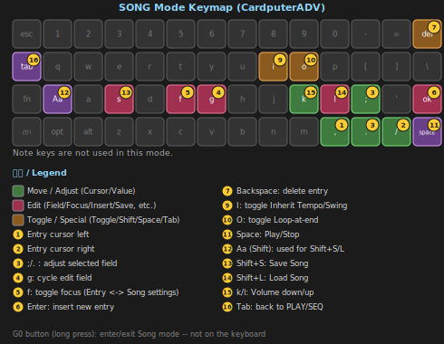

# C.P.S. — CardPuter Synth

*[日本語版はこちら / Japanese version here](README_ja.md)*

A feature-rich DIY synthesizer for the **M5Stack Cardputer family** (CardputerADV / original Cardputer), built with PlatformIO and the Arduino framework.

I share my ideas with Claude and have it write the code.
I share development progress on Reddit and my [Twitter (X) account](https://x.com/Tokagetchi) — community feedback has been the spark for many of the features below!
Thank you so much to everyone who's shown interest in this project!

> **This project is currently 100% vibe-coded.**
> My apologies to anyone who isn't comfortable with AI use or vibe coding.

---

## 🆕 v0.9 Update

v0.9 opens up a whole new way to enjoy CPS beyond just playing live — building and listening to arrangements.

- **Added a Scale system**: in Pro Mode, choose from 49 scales across 9 categories (Chromatic / Classical / Symmetrical / Pentatonic / Japan / China / India / Middle East / Europe) via a 2-level picker, with live preview while you play
- **Added an Arpeggiator** (CardputerADV only): hold up to 6 notes as a chord, with UP / DOWN / UP-DOWN / AS PLAYED / RANDOM patterns and adjustable Tempo/Rate/Swing. `V` toggles Latch mode (hold notes without holding keys), `Shift+V` toggles the Arp on/off from any screen
- **Added a Step Sequencer (SEQ mode)**: a 16-step, TB-303-style sequencer. Beyond pitch and velocity, each step also supports **Tie** (extend the previous note), **Slide** (glide into the next pitch), and **Accent**. `G0` gives you a one-touch toggle between PLAY and SEQ. Steps can be copied, cut, and pasted
- **Added a Pattern Bank**: save/load your sequences across 8 banks (A–H) × 8 slots each, with a Random Pattern generator too
- **Added Song mode**: arrange saved patterns into a full song, with independent Transpose and Repeat count per pattern. Access it with a long press of `G0`. A timeline + mini-preview UI makes the arrangement easy to read at a glance
- **Reverse Tab-cycling**: `Shift+Tab` now cycles the menu backward
- Major optimization work on display flicker and audio processing, resulting in a noticeably smoother feel overall

---

## 🆕 v0.8 Update

v0.8 is a major overhaul focused on the IMU.

- **SETTING menu redesigned as category launchers**: Patch / IMU(PAD) / Bend / Portamento / Play Mode are now just entry points — selecting one opens its own dedicated screen
- **Expanded IMU targets to 17** (up from 10 — added PWM/Detune/Noise/SubLevel/Resonance/LFO Rate/LFO Depth). Target selection is now a scrollable list with category divider lines
- **Added fine per-axis IMU control**: Sensitivity, axis Invert, response Curve (Linear/Exponential), Deadzone, and Calibrate (ON/OFF toggle)
- **IMU Volume target is now a relative multiplier** of the current volume, so it can no longer exceed the set level
- **Patch Bank gained Reset and Randomize**: one-tap tone reset or full-parameter randomization, both behind a confirmation dialog
- **Bend and Portamento each got their own dedicated reset**
- **Added Play Mode (EZ / Pro)**: EZ Mode is a beginner-friendly diatonic layout, Pro Mode is a full chromatic layout with black keys. Switchable from the SETTING menu
- **Added original Cardputer support**: devices without an IMU get key-driven "PAD" control instead, auto-detected at boot
- Extensive investigation and optimization of audio dropouts/stutter, resulting in substantially improved stability

---

## 🆕 v0.7 Update

v0.7 significantly expanded the sound-editing capabilities.

- **Split the EDIT menu into VCO / VCF / VCA screens** (retiring the old single EDIT menu for a more "real synth" editing feel)
- Added a **sub oscillator** (-1oct / -2oct, adjustable level)
- Added **noise blend**
- Added **filter key tracking** (cutoff follows the played pitch)
- Added a **dedicated filter envelope** (Depth/Attack/Decay/Release)
- Added a **general-purpose LFO** as a new tab (Sine/Triangle/Sawtooth/Square, Rate 0.1–20Hz, Depth 0–100%, Target: Pitch/Volume/Timbre/Filter/PWM)
- Added a **"None" (bypass) filter type**
- Added a **Patch Bank**: save/recall every parameter as a named patch, with rename/duplicate/delete

---

## Features

| Category | Details |
|---|---|
| **Oscillator** | Real-time wavetable synthesis: Sine → Triangle → Sawtooth → Square (morphable), with PWM |
| **Sub oscillator** | -1oct / -2oct, adjustable level |
| **Noise** | Noise blend (adjustable level) |
| **Keyboard (EZ Mode)** | `1234567890-=` + Backspace mapped to a 13-note diatonic scale (C4-A5); monophonic (last key wins) |
| **Keyboard (Pro Mode)** | Two physical rows, each a complete chromatic octave including black keys (`1234567890-=`+Backspace = C4-C5, `qwertyuiop[]\` = C3-C4). **49 selectable scales** |
| **Octave** | `;` / `.` keys shift ±2 octaves (`J`/`N` on original Cardputer) |
| **Transpose** | `,` / `/` keys shift ±12 semitones (`B`/`M` on original Cardputer) |
| **Volume** | `k` / `l` keys adjust in 5% steps (works on almost every screen except Patch Bank) |
| **Bend** | `Z` key = bend down, `X` key = bend up — guitar-choke feel with asymmetric attack/release |
| **ADSR** | Full Attack/Decay/Sustain/Release envelope with retrigger support |
| **Biquad Filter** | LPF / HPF / BPF / Notch / None (bypass); configurable cutoff (100–8000Hz), Q, and key tracking |
| **Filter envelope** | Dedicated Depth/Attack/Decay/Sustain/Release envelope for the filter cutoff |
| **General-purpose LFO** | Sine/Triangle/Sawtooth/Square, Rate 0.1–20Hz, Depth 0–100%. Modulates Pitch, Volume, Timbre, Filter, or PWM |
| **Bit-crusher** | Lo-Fi effect: reduces bit depth from 16-bit down to ~3-bit |
| **Vibrato / Tremolo** | LFO-driven pitch/volume modulation (independent of the general-purpose LFO) |
| **Portamento** | ON/OFF, adjustable glide speed, with its own dedicated reset |
| **Arpeggiator** (ADV only) | Up to 6-note chord hold. UP/DOWN/UP-DOWN/AS PLAYED/RANDOM, adjustable Tempo/Rate/Swing, Latch mode |
| **Step Sequencer (SEQ mode)** | 16-step, TB-303-style. Tie/Slide/Accent per step, with Copy/Cut/Paste |
| **Pattern Bank** | Save/load sequences across 8 banks x 8 slots, plus Random Pattern generation |
| **Song mode** | Arrange saved patterns into a song, with independent Transpose/Repeat per entry |
| **IMU / PAD mapping** | 17 assignable targets; Sensitivity, axis Invert, response Curve, Deadzone, and Calibration adjustable per axis (Deadzone/Calibration unavailable on original Cardputer) |
| **Patch Bank** | Save/recall every parameter as a named patch. Rename, duplicate, delete, reset, and randomize supported |
| **Play Mode** | EZ Mode (diatonic) / Pro Mode (chromatic, scale-selectable), switchable from the SETTING menu |
| **SD settings** | Current settings auto-save to `/CPS/settings.json` |

### IMU / PAD assignable targets (17)

`TIMBRE` · `VIBRATO_DEPTH` · `VIBRATO_RATE` · `TREMOLO` · `VOLUME` · `PITCH_BEND` · `BEND_UP` · `BEND_DOWN` · `BITCRUSH` · `FILTER_CUTOFF` · `PWM` · `DETUNE` · `NOISE` · `SUB_LEVEL` · `RESONANCE` · `LFO_RATE` · `LFO_DEPTH` (+ `NONE`)

- **PITCH_BEND** — bipolar: tilt direction (or PAD press direction) controls bend direction
- **BEND_UP / BEND_DOWN** — absolute: always raises / lowers pitch
- **VOLUME** — a relative multiplier (0-100%) of the current volume; can only attenuate, never exceeds the set level
- **ArpTempo / ArpSwing** — controls the Arpeggiator's Tempo/Swing while PLAY is active, or the Sequencer's own Tempo/Swing while SEQ is active — the same axis assignment automatically applies to whichever is relevant

---

## Hardware

| Item | Value |
|---|---|
| Supported devices | M5Stack CardputerADV, original Cardputer (auto-detected at boot) |
| MCU | ESP32-S3 (dual-core Xtensa LX7, 240 MHz) |
| Audio | ES8311 codec + NS4150B amp (ADV), NS4168+SPM1423 (original), 1 W speaker, 3.5 mm jack |
| IMU | BMI270 6-axis (**CardputerADV only**) |
| SD slot | SPI — SCK=GPIO40, MISO=GPIO39, MOSI=GPIO14, CS=GPIO12 |

> **Regarding the original Cardputer (non-ADV / v1.1)**: auto-detected at boot, with key-driven "PAD" control substituting for the missing IMU. I don't have the hardware myself, so I haven't been able to verify this personally yet. Also, the original's keyboard hardware only officially supports **up to 3 simultaneous key presses** — pressing a 4th key at the same time may cause key ghosting (incorrect detection). This is a hardware limitation that can't be fully corrected in software. Bug reports and feedback from original-Cardputer owners are very welcome.

---

## Getting started

### Option 1 — Install via M5Burner (easiest, recommended)

No compiling required — the quickest way to get CPS on your device.

1. Download and install [M5Burner](https://docs.m5stack.com/en/uiflow/M5Burner) from the official site
2. Connect your Cardputer (ADV or original) to your computer via USB-C
3. Search for "C.P.S." (CardPuter Synth) inside M5Burner
4. Select the correct COM port and click "Burn"
5. Once flashing completes, CPS will launch automatically

> Inserting a FAT32-formatted SD card lets you use auto-save and the Patch Bank / Pattern Bank / Song features.

---

### Option 2 — Install via Launcher FW

If your CardputerADV runs **Launcher FW**, you can install CPS without building anything yourself.

#### Option 2a — Using OTA (recommended, easiest)

1. Boot into Launcher FW on your CardputerADV
2. Search for "C.P.S." (CardPuter Synth) via the OTA feature
3. Select the firmware that appears and download/install it
4. CPS will launch automatically once installed

#### Option 2b — Manually copying to the SD card

1. Go to the [Releases](../../releases) page and download the latest `.bin` file
2. Copy the `.bin` file to the **root of your SD card** (not inside a subfolder)
3. Insert the SD card into your CardputerADV and boot into Launcher FW
4. Navigate to the `.bin` file in the Launcher file browser and select it to flash
5. CPS will launch automatically after flashing

> A FAT32-formatted micro-SD card is required both for a Launcher install via Option 2b and for CPS's settings persistence.

---

### Option 3 — Build from source (PlatformIO)

#### Requirements

- [VSCode](https://code.visualstudio.com/) with the **PlatformIO IDE** extension
- M5Stack Cardputer (ADV or original) connected via USB-C

#### Build & flash

1. Clone or download this repository
2. Open the `CPS` folder in VSCode (`File › Open Folder`)
3. PlatformIO will auto-detect `platformio.ini` and download the required libraries on the first build
4. Click **Upload** (→ button in the bottom toolbar)

After a successful build, two files are generated in `.pio/build/cps/`:

| File | Purpose |
|---|---|
| `firmware.bin` | App binary only — used by PlatformIO's Upload button |
| `merge.bin` | **Merged** (bootloader + partitions + app) — use this for M5Burner or any single-file flash tool |

> **Boot-to-flash mode** (if upload fails): power off → hold G0 → power on → release G0.

### First boot (all install methods)

On first boot the app creates `/CPS/` on the SD card (along with the `Patch` / `Pattern` / `Song` subfolders) — a FAT32 micro-SD is required.
Settings save to `/CPS/settings.json` automatically whenever you leave the SEQ or SETTING screen.
If no SD card is present the app still runs with default settings.

---

## Controls

### Mode-switching quick reference

| Action | Result |
|---|---|
| `Tab` | Cycle menus forward (PLAY/SEQ → VCO → VCF → VCA → LFO → SETTING → PLAY/SEQ) |
| `Shift+Tab` | Cycle menus backward |
| `G0` (short press) | Toggle PLAY mode ⇔ SEQ mode |
| `G0` (long press, ~0.5s) | Enter Song mode (long press again to return) |

### PLAY screen



| Key | Action |
|---|---|
| Note keys | Play notes (layout differs by EZ/Pro Mode — see Features above) |
| `;` / `.` (ADV), `J`/`N` (original) | Octave up / down (±2 octaves) |
| `,` / `/` (ADV), `B`/`M` (original) | Transpose down / up (±12 semitones) |
| `k` / `l` | Volume down / up |
| `Z` | Bend down (hold) |
| `X` | Bend up (hold) |
| `C` | Toggle portamento ON/OFF |
| `A` | Toggle IMU/PAD X-axis hold ON/OFF |
| `S` | Toggle IMU/PAD Y-axis hold ON/OFF |
| `D` | Toggle note hold ON/OFF |
| `V` | Toggle Arp Latch ON/OFF (ADV only) |
| `Shift+V` | Toggle the Arpeggiator ON/OFF (ADV only, works from any screen) |
| `Space` | Play/Stop the Sequencer's pattern (works even outside the SEQ screen) |
| `H` (hold) | Show help overlay |
| Tilt device (ADV) / `;`/`.`/`,`/`/` for PAD (original) | Controls whichever parameters are assigned to the IMU/PAD X/Y axes |

The PLAY screen shows the current note name/frequency, octave/transpose/portamento/note-hold state, a bend meter, IMU/PAD status, and the IMU/PAD X/Y target names with their current values — appending **(HOLD)** whenever that axis is held. While the Arpeggiator is on, every held note is listed instead.

### VCO screen

Left column: Timbre · PWM · Detune · FineTune　　Right column: Sub Lvl · Sub Oct · Noise

| Key | Action |
|---|---|
| `;` / `.` | Select previous / next item |
| `,` / `/` | Decrease / increase value |

### VCF screen

Left column: Filter (type) · Cutoff · Resonance · KeyTrack　　Right column: FEnv Depth · Attack · Decay · Release (dedicated filter envelope)

| Key | Action |
|---|---|
| `;` / `.` | Select previous / next item |
| `,` / `/` | Decrease / increase value |

Filter type can be set to LPF / HPF / BPF / Notch / None (bypass).

> **To hear the Notch filter clearly**: pick a harmonically rich waveform (Saw/Square rather than Sine), set Cutoff to roughly 600–1500Hz and Resonance fairly high, then hold a sustained note while slowly sweeping Cutoff up and down.

### VCA screen (ADSR)

Attack · Decay · Sustain · Release

| Key | Action |
|---|---|
| `;` / `.` | Select previous / next item |
| `,` / `/` | Decrease / increase value |

### LFO screen

Wave · Rate (0.1–20 Hz) · Depth (0–100%) · Target (modulation destination)

| Key | Action |
|---|---|
| `;` / `.` | Select previous / next item |
| `,` / `/` | Decrease / increase value |

The top of the screen shows the LFO waveform along with a live marker tracking its current phase.

### SEQ screen (Step Sequencer)

Toggle here from PLAY with a quick tap of `G0`. A 16-step, TB-303-style sequencer where each step can carry a pitch/velocity plus Tie (extend the previous note), Slide, and Accent.



| Key | Action |
|---|---|
| Note keys | Assign a pitch to the selected step (plays a preview and auto-advances to the next step) |
| `,` / `/` | Move the step cursor |
| `f` | Toggle edit focus (Step editing ⇔ Pattern settings) |
| `g` | Cycle the edit field (Step focus: Velocity→Tie→Slide→Accent / Pattern focus: Tempo→Swing) |
| `;` / `.` | Adjust the selected field (numeric fields increase/decrease; Tie/Slide/Accent toggle) |
| `Backspace` | Clear the selected step |
| `Shift+Backspace` | Clear all 16 steps |
| `V` | Mark / confirm / clear a step-range selection |
| `Shift+C` | Copy the selection |
| `Shift+X` | Cut the selection |
| `Enter` | Paste at the cursor |
| `Space` | Play/Stop the pattern |
| `k` / `l` | Volume down / up |
| `H` (hold) | Show help overlay |

On the step grid, velocity is shown as bar height, and a run of Tie-connected steps merges into one shape with a thick outline. Accented steps turn red.

### SETTING screen

Entry points: Patch / Pattern / IMU (PAD on original) / Bend / Portamento / Play Mode / Arp (ADV only). **Patch/IMU/Bend/Portamento show up from either PLAY or SEQ; Pattern only shows up when SEQ is the active home mode, and Arp only when PLAY is.**

| Key | Action |
|---|---|
| `;` / `.` | Select previous / next item |
| `,` / `/` | Open the selected category |
| `Tab` | Save settings and return to the PLAY/SEQ screen |

#### Patch sub-menu

Save · Load · Reset (tone reset) · Random (tone randomize). Both Reset and Random are behind a confirmation dialog.

#### Pattern sub-menu

Save · Load · Random (pattern randomize). Random draws from the currently active scale and includes Tie/Slide/Accent, not just pitch/velocity.

#### IMU / PAD sub-menu

Target · Sensitivity · Invert · Curve · Deadzone (hidden on original Cardputer) per axis, plus Calibrate (ON/OFF toggle, ADV only).

Target selection opens a scrollable picker via `/`, with category divider lines (Pitch/Volume/Timbre/Filter/LFO/Effect); `;`/`.` to scroll, `/` or Enter to confirm.

#### Bend sub-menu

Bend width · attack · release · Reset.

#### Portamento sub-menu

ON/OFF · speed · Reset.

#### Play Mode sub-menu

Toggle between EZ Mode and Pro Mode; when in Pro Mode, also select a scale (49 scales across 9 categories).

#### Arp sub-menu (ADV only)

Type (UP/DOWN/UP-DOWN/AS PLAYED/RANDOM) · Tempo · Rate · Swing. The On/Off toggle itself lives on `Shift+V` (works from any screen) rather than in this menu.

### Patch Bank screen

Opened from the Patch sub-menu's Save or Load item.

| Key | Action |
|---|---|
| `;` / `.` | Select previous / next patch |
| `/` or `Enter` | Confirm (Load / new Save / confirm overwrite) |
| `r` | Rename the selected patch |
| `c` | Duplicate the selected patch |
| `,` | Delete the selected patch (with confirmation) |
| `Tab` | Go back one level |

In Save mode, a `<New Patch>` entry appears at the top of the list for creating a new patch. Patches are only ever saved inside `/CPS/Patch/` — the app cannot navigate to any other folder.

### Pattern Bank screen

Opened from the Pattern sub-menu's Save or Load item. Choose from a grid of 8 banks (A–H) × 8 slots (1–8).

| Key | Action |
|---|---|
| `;` / `.` / `,` / `/` | Move around the bank/slot grid |
| `Enter` | Confirm (Load / new Save / confirm overwrite) |
| `Backspace` | Clear the selected slot (with confirmation) |
| `Tab` | Go back one level |

Patterns are saved under `/CPS/Pattern/` with a filename combining the bank letter and slot number (e.g. `A1.json`).

### Song mode screen

Enter with a long press of `G0`. Arrange saved patterns into a full song and play them back.



| Key | Action |
|---|---|
| `,` / `/` | Move the entry cursor |
| `f` | Toggle edit focus (Entry editing ⇔ Song-level settings) |
| `g` | Cycle the edit field (Entry focus: Bank→Slot→Transpose→Repeat / Song focus: Tempo→Swing) |
| `;` / `.` | Adjust the selected field |
| `Enter` | Insert a new entry right after the cursor |
| `Backspace` | Delete the selected entry |
| `I` | Toggle whether each entry inherits its own pattern's Tempo/Swing |
| `O` | Toggle whether the song loops back to the start after the last entry |
| `Space` | Play/Stop the song |
| `Shift+S` / `Shift+L` | Save / Load the song |
| `k` / `l` | Volume down / up |
| `Tab` | Return to whichever of PLAY/SEQ was active |

Entries appear as a horizontal timeline of blocks color-coded by bank letter (the bar beneath each block shows its Repeat count), with a small preview grid showing the shape of whichever pattern is playing (or selected, while stopped). Transpose is chromatic (semitone-based) and independent per entry. Songs save under `/CPS/Song/` by number (1–8).

---

## Differences on the original Cardputer

Auto-detected at boot; the following differ from CardputerADV:

- **PAD control instead of IMU**: `;`/`.` move a virtual Y axis, `,`/`/` move a virtual X axis. Moves toward the extreme while held, springs back to center on release (toggle Hold with `A`/`S` to keep it from springing back)
- **Octave/Transpose keys move**: since PAD control needs those keys, Octave is on `J`/`N` and Transpose is on `B`/`M` instead
- **Deadzone and Calibrate are hidden**: neither concept applies to a key-driven PAD (no sensor noise to filter, no physical zero-point to correct)
- **Arpeggiator is not supported**: it needs multi-key chord holding, which the original's 3-key rollover limit can't reliably support
- **Step Sequencer, Pattern Bank, and Song mode all work on both boards**: entering one note per step doesn't need key rollover, so these aren't affected by the 3-key limit
- **3-key rollover limit**: due to hardware constraints, pressing a 4th key at the same time may cause key ghosting

---

## Signal path

```
Oscillator (wavetable morph)
    │
    ├── Sub oscillator (-1/-2 oct)
    ├── Noise blend
    │
    ▼
Bit-crusher
    │
    ▼
Biquad Filter  ◄── Filter envelope / Filter key tracking / IMU(PAD) / General LFO (Filter)
    │
    ▼
Volume (key vol × IMU(PAD) volume multiplier + General LFO (Volume))
    │
    ▼
Tremolo (LFO × depth)
    │
    ▼
ADSR Envelope
    │
    ▼
Speaker (I2S)
```

Pitch modulation (vibrato LFO + IMU(PAD) bend + key bend + General LFO (Pitch)) is applied to the oscillator phase increment before sample generation. In SEQ/Song mode, this same path is driven by the Sequencer's own timing engine.

---

## Project structure

```
CPS/
├── platformio.ini      # Build configuration
├── merge_bin.py         # Post-build script: generates merge.bin for M5Burner
└── src/
    └── main.cpp          # All source code (single-file)
```

---

## Dependencies

Managed automatically by PlatformIO:

| Library | Version |
|---|---|
| `m5stack/M5Cardputer` | ≥ 1.1.1 |
| `m5stack/M5Unified` | ≥ 0.2.8 |
| `m5stack/M5GFX` | ≥ 0.2.10 |

`SD` and `SPI` are part of the Arduino-ESP32 core and require no extra entry in `lib_deps`.

---

## Known limitations / future ideas

- Monophonic only (last note wins); polyphony is not planned
- Original Cardputer support hasn't been verified on real hardware by the developer yet (bug reports/feedback welcome)
- Display is 240×135 px; layout is tight
- v1.0: still under consideration

---

## License

MIT — feel free to use, modify, and share.
If you build something cool with CPS, consider sharing it with the community!
