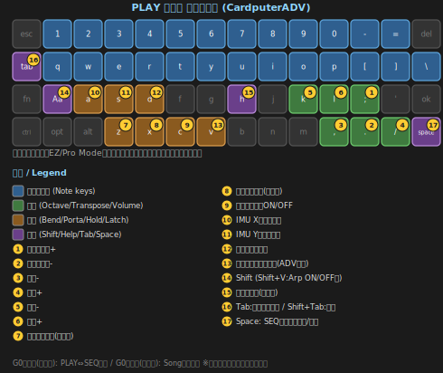
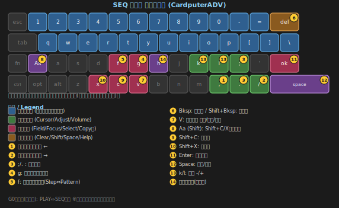
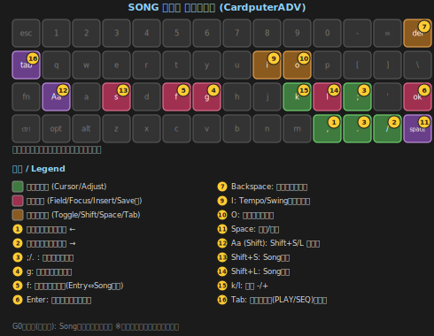

# C.P.S. — CardPuter Synth

*[English version here / 英語版はこちら](README.md)*

**M5Stack Cardputerシリーズ**（CardputerADV / オリジナルCardputer）向けの本格DIYシンセサイザーです。PlatformIO + Arduinoフレームワークで開発しています。

Claudeに私のアイデアを伝えコーディングしてもらっています。
Redditや私の[Twitter(X)アカウント](https://x.com/Tokagetchi)で開発状況を公開・共有しています。コミュニティからのフィードバックが多くの機能追加のきっかけになりました！
興味を持ってくださったユーザーの皆さん、本当にありがとうございます！

> **現状100%バイブコーディングです！**
> AIの使用やバイブコーディングに抵抗がある方は申し訳ありません！

---

## 🆕 v0.9 アップデート情報

v0.9では「弾く」だけでなく「組み立てて聴く」楽しみ方を大きく広げました。

- **スケールシステムを追加**：Pro Modeで、49種類のスケールを9カテゴリー（Chromatic / Classical / Symmetrical / Pentatonic / Japan / China / India / Middle East / Europe）から選択可能。2段階のピッカーで、演奏しながらリアルタイムにプレビューできます
- **アルペジエーター搭載**（CardputerADVのみ）：最大6音のコードホールドに対応。UP / DOWN / UP-DOWN / AS PLAYED / RANDOMの5パターン、Tempo・Rate・Swingを調整可能。`V`キーでラッチ（コード保持）、`Shift+V`でどの画面からでもON/OFF切り替え可能
- **ステップシーケンサー（SEQモード）を追加**：16ステップのTB-303スタイルシーケンサー。音符・ベロシティに加え、**Tie（音の連結）・Slide（スライド）・Accent（アクセント）**に対応。G0ボタンでPLAYモードとワンタッチ切り替え。ステップのコピー・カット・ペースト機能も搭載
- **Pattern Bank**：組んだシーケンスパターンを8バンク（A〜H）×8スロットに保存・呼び出し可能。ランダムパターン生成にも対応
- **Songモード**：保存したパターンを並べて、ひとつの楽曲として演奏できる新モード。パターンごとにトランスポーズ・リピート回数を設定可能。G0ボタン長押しでアクセス。タイムライン表示＋ミニプレビューで、視覚的にも分かりやすいUIに
- **Tabキーの逆サイクル移動**：`Shift+Tab`でメニューを逆順に移動できるようになりました
- 画面のちらつき・音声処理まわりの大規模な最適化を実施し、操作感が大幅に向上

---

## 🆕 v0.8 アップデート情報

v0.8ではIMU周りを中心に、全面的な機能拡張を行いました。

- **SETTINGメニューをカテゴリー方式に刷新**：Patch / IMU(PAD) / Bend / Portamento / Play Mode の入り口だけを並べ、選択すると各専用画面が開く方式に変更
- **IMU操作パラメータを17種類に拡張**（従来10種 + PWM/Detune/Noise/SubLevel/Resonance/LFO Rate/LFO Depth）。選択方法もスクロール一覧＋カテゴリー区切り線付きに刷新
- **IMUの細かい調整機能を追加**：感度・軸反転・応答カーブ（Linear/Exponential）・デッドゾーン・キャリブレーション（ON/OFF切り替え式）
- **IMUのVolumeターゲットを相対倍率方式に変更**：設定音量を超えて大きくなることがなくなりました
- **Patch Bankに初期化・ランダム生成機能を追加**：確認ダイアログ付きで、ワンタッチで音色をリセット、または全パラメータをランダム生成
- **Bend・Portamentoにもそれぞれ専用の初期化機能を追加**
- **Play Mode（EZ / Pro）を追加**：EZ Modeは初心者にも分かりやすいダイアトニック(全音階)配列、Pro Modeは黒鍵を含むフルクロマチック配列。SETTINGメニューで切り替え可能
- **オリジナルCardputer対応**：IMUがない機種でも、キー操作でIMU相当の操作（PAD機能）ができるように対応。起動時に自動判別
- 音の途切れ・処理落ちに関する大規模な調査・最適化を実施し、安定性が大幅に向上

---

## 🆕 v0.7 アップデート情報

v0.7では音色エディット機能を大幅に強化しました。

- **EDITメニューを VCO / VCF / VCA の3画面に細分化**（旧バージョンの単一EDITメニューを廃止し、より本格的なシンセのような編集体験に）
- **サブオシレーター**（-1oct / -2oct、レベル可変）を追加
- **ノイズブレンド**を追加
- **フィルターのキートラッキング**を追加（音程に応じてカットオフが追従）
- **フィルター専用エンベロープ**（Depth/Attack/Decay/Release）を追加
- **汎用LFO**を新設タブとして追加（Sine/Triangle/Sawtooth/Square、Rate 0.1〜20Hz、Depth 0〜100%、Target: Pitch/Volume/Timbre/Filter/PWM）
- **フィルタータイプに「None」（バイパス）を追加**
- **Patch Bank機能を追加**：全パラメータを、名前を付けて保存・呼び出し。リネーム・複製・削除にも対応

---

## 主な機能

| カテゴリ | 内容 |
|---|---|
| **オシレーター** | リアルタイム・ウェーブテーブル方式：Sine → Triangle → Sawtooth → Square（モーフィング可能）、PWM対応 |
| **サブオシレーター** | -1oct / -2oct、レベル可変 |
| **ノイズ** | ノイズブレンド（レベル可変） |
| **キーボード（EZ Mode）** | `1234567890-=` + Backspaceキーで、C4〜A5の13音ダイアトニック(全音階)スケール。モノフォニック（後着優先） |
| **キーボード（Pro Mode）** | 2段の物理キーで、それぞれ黒鍵込みの1オクターブ完結クロマチック配列（`1234567890-=`+Backspace = C4〜C5、`qwertyuiop[]\` = C3〜C4）。**49種類のスケール**から選択可能 |
| **オクターブ** | `;` / `.` キーで ±2オクターブ（オリジナルCardputerは`J`/`N`） |
| **転調（キー変更）** | `,` / `/` キーで ±12半音（オリジナルCardputerは`B`/`M`） |
| **音量** | `k` / `l` キーで5%刻みに調整（Patch Bank以外のほぼ全画面で操作可能） |
| **ベンド** | `Z` キー = ベンドダウン、`X` キー = ベンドアップ（ギターのチョーキングのような非対称アタック/リリース） |
| **ADSR** | フルAttack/Decay/Sustain/Releaseエンベロープ、リトリガー対応 |
| **Biquadフィルター** | LPF / HPF / BPF / Notch / None（バイパス）。カットオフ(100〜8000Hz)・Q・キートラッキング調整可 |
| **フィルターエンベロープ** | フィルターカットオフ専用のDepth/Attack/Decay/Sustain/Releaseエンベロープ |
| **汎用LFO** | Sine/Triangle/Sawtooth/Square、Rate 0.1〜20Hz、Depth 0〜100%。Pitch/Volume/Timbre/Filter/PWMのいずれかを変調 |
| **ビットクラッシャー** | 16bitから約3bitまでビット深度を落とすローファイエフェクト |
| **ビブラート／トレモロ** | LFOによるピッチ／音量変調（汎用LFOとは独立） |
| **ポルタメント** | ON/OFF、グライド速度調整可。専用の初期化機能付き |
| **アルペジエーター**（ADVのみ） | 最大6音のコードホールド。UP/DOWN/UP-DOWN/AS PLAYED/RANDOM、Tempo・Rate・Swing調整可、ラッチモード対応 |
| **ステップシーケンサー（SEQモード）** | 16ステップのTB-303スタイル。Tie/Slide/Accent対応、コピー＆ペースト機能付き |
| **Pattern Bank** | シーケンスパターンを8バンク×8スロットに保存/呼び出し。ランダムパターン生成にも対応 |
| **Songモード** | 保存したパターンを並べて演奏。トランスポーズ・リピート回数を個別設定可能 |
| **IMU / PAD マッピング** | 17種類のパラメータへ割り当て可能。感度・軸反転・応答カーブ・デッドゾーン・キャリブレーションを軸ごとに調整可（オリジナルCardputerではデッドゾーン・キャリブレーションを除く） |
| **Patch Bank** | 全パラメータを名前を付けて保存/呼び出し。リネーム・複製・削除・初期化・ランダム生成に対応 |
| **Play Mode** | EZ Mode（ダイアトニック）／ Pro Mode（クロマチック、スケール選択可）をSETTINGメニューで切り替え |
| **SD保存** | 現在の設定を `/CPS/settings.json` に自動保存 |

### IMU / PAD 割り当て可能なターゲット（17種）

`TIMBRE` · `VIBRATO_DEPTH` · `VIBRATO_RATE` · `TREMOLO` · `VOLUME` · `PITCH_BEND` · `BEND_UP` · `BEND_DOWN` · `BITCRUSH` · `FILTER_CUTOFF` · `PWM` · `DETUNE` · `NOISE` · `SUB_LEVEL` · `RESONANCE` · `LFO_RATE` · `LFO_DEPTH`（+ `NONE`）

- **PITCH_BEND** — バイポーラ：傾き（またはPADの押す方向）がそのままベンドの方向になります
- **BEND_UP / BEND_DOWN** — 絶対値：常にピッチを上げる/下げる方向に作用します
- **VOLUME** — 現在の音量に対する相対倍率（0〜100%）。傾き/PAD操作の量に応じて減衰するのみで、設定音量を超えることはありません
- **ArpTempo / ArpSwing** — PLAYモードではArpのTempo/Swingを、SEQモードではSEQ自体のTempo/Swingを操作します（同じ軸設定のまま、起点となっているモードに応じて自動で切り替わります）

---

## ハードウェア

| 項目 | 値 |
|---|---|
| 対応デバイス | M5Stack CardputerADV、オリジナルCardputer（起動時に自動判別） |
| MCU | ESP32-S3（デュアルコア Xtensa LX7、240MHz） |
| オーディオ | ES8311コーデック + NS4150Bアンプ（ADV）、NS4168+SPM1423（オリジナル）、1Wスピーカー、3.5mmジャック |
| IMU | BMI270 6軸（**CardputerADVのみ搭載**） |
| SDスロット | SPI — SCK=GPIO40, MISO=GPIO39, MOSI=GPIO14, CS=GPIO12 |

> **オリジナル版Cardputer（無印/v1.1）について**：起動時に自動判別され、IMUがない代わりにキー操作でPAD相当の操作ができるようになっています。ただし手元に実機がなく、開発者自身による動作確認はまだ行えていません。また、オリジナル版のキーボードはハードウェアの制約上、**同時押しが3キーまで**しか正式にサポートされておらず、4キー以上を同時に押すと、キーの誤検出（ゴースト入力）が発生する可能性があります。これはソフトウェア側では完全には対処できないハードウェアの制限です。動作報告やフィードバックをお待ちしています。

---

## インストール方法

### 方法1 — M5Burnerでインストール（一番簡単・おすすめ）

コンパイル不要で、最も手軽にインストールできる方法です。

1. [M5Burner](https://docs.m5stack.com/en/uiflow/M5Burner) を公式サイトからダウンロード・インストールします
2. お使いのCardputer（ADVまたはオリジナル）をUSB-Cでパソコンに接続します
3. M5Burner内で「C.P.S.」（CardPuter Synth）を検索します
4. 対象のCOMポートを選択し、「Burn」（書き込み）ボタンを押します
5. 書き込みが完了すると、CPSが自動的に起動します

> SDカード（FAT32フォーマット）を挿入しておくと、設定の自動保存やPatch Bank / Pattern Bank / Song機能が使えるようになります。

---

### 方法2 — Launcher FW経由でのインストール

CardputerADVで **Launcher FW** を使用している場合は、コンパイルせずにインストールできます。

#### 方法2a — OTA機能を使う（おすすめ・一番簡単）

1. CardputerADVでLauncher FWを起動します
2. OTA機能から「C.P.S.」（CardPuter Synth）を検索します
3. 表示されたファームウェアを選択し、ダウンロード・インストールします
4. インストール完了後、CPSが自動的に起動します

#### 方法2b — SDカードに手動コピーする

1. [Releases](../../releases) ページから最新の `.bin` ファイルをダウンロードします
2. `.bin` ファイルをSDカードの**ルート直下**にコピーします（サブフォルダに入れないでください）
3. SDカードをCardputerADVに挿入し、Launcher FWで起動します
4. Launcherのファイルブラウザで対象の `.bin` ファイルを選択して書き込みます
5. 書き込み完了後、CPSが自動的に起動します

> FAT32フォーマットのmicro SDカードが、Launcher経由のインストール（方法2b）とCPSの設定保存の両方に必要です。

---

### 方法3 — ソースからビルド（PlatformIO）

#### 必要なもの

- [VSCode](https://code.visualstudio.com/) + **PlatformIO IDE** 拡張機能
- USB-C接続したM5Stack Cardputer（ADVまたはオリジナル）

#### ビルド＆書き込み手順

1. 本リポジトリをクローンまたはダウンロードします
2. VSCodeで `CPS` フォルダを開きます（`File › Open Folder`）
3. `platformio.ini` が自動検出され、初回ビルド時に必要なライブラリが自動でダウンロードされます
4. 画面下部ツールバーの **Upload**（→ボタン）をクリックします

ビルド成功後、`.pio/build/cps/` 内に以下の2ファイルが生成されます。

| ファイル | 用途 |
|---|---|
| `firmware.bin` | アプリ本体のみ（PlatformIOのUploadボタンで使用） |
| `merge.bin` | **統合バイナリ**（bootloader + partitions + app）。M5Burnerや単一ファイル書き込みツールで使用 |

> **書き込みモードに入らない場合**：電源オフ → G0ボタンを押しながら電源オン → G0ボタンを離す

### 初回起動時（インストール方法共通）

初回起動時、SDカード上に自動的に `/CPS/` フォルダ（および `Patch` / `Pattern` / `Song` サブフォルダ）が作成されます（FAT32フォーマットのmicro SDカードが必要）。
設定は、SEQ画面やSETTING画面から抜ける際に自動的に `/CPS/settings.json` へ保存されます。
SDカードが挿入されていない場合でも、デフォルト設定でアプリは動作します。

---

## 操作方法

### モード切り替え早見表

| 操作 | 動作 |
|---|---|
| `Tab` | メニューを順に切り替え（PLAY/SEQ → VCO → VCF → VCA → LFO → SETTING → PLAY/SEQ） |
| `Shift+Tab` | メニューを逆順に切り替え |
| `G0`（短押し） | PLAYモード ⇔ SEQモード をワンタッチ切り替え |
| `G0`（長押し・約0.5秒） | Songモードへ切り替え（もう一度長押しで元のモードへ） |

### PLAY画面



| キー | 動作 |
|---|---|
| ノートキー | 音を再生（EZ/Pro Modeで配列が異なる。上記「主な機能」参照） |
| `;` / `.`（ADV）、`J`/`N`（オリジナル） | オクターブ 上げ / 下げ（±2オクターブ） |
| `,` / `/`（ADV）、`B`/`M`（オリジナル） | 転調 下げ / 上げ（±12半音） |
| `k` / `l` | 音量 下げ / 上げ |
| `Z` | ベンドダウン（押している間） |
| `X` | ベンドアップ（押している間） |
| `C` | ポルタメント ON/OFF切り替え |
| `A` | IMU/PAD X軸のホールド ON/OFF切り替え |
| `S` | IMU/PAD Y軸のホールド ON/OFF切り替え |
| `D` | ノートホールド ON/OFF切り替え |
| `V` | アルペジエーター・ラッチ ON/OFF切り替え（ADVのみ） |
| `Shift+V` | アルペジエーター ON/OFF切り替え（ADVのみ、他の画面からも操作可能） |
| `Space` | SEQのパターン再生/停止（SEQ画面にいなくても操作可能） |
| `H`（長押し） | ヘルプ表示 |
| デバイスを傾ける（ADV）／`;`/`.`/`,`/`/`でPAD操作（オリジナル） | IMU/PAD X/Y軸に割り当てたパラメータを操作 |

PLAY画面には、現在の音名・周波数・オクターブ/転調/ポルタメント/ノートホールド状態、ベンドメーター、IMU/PADの状態、IMU/PAD X/Y軸のターゲットと現在値（ホールド中は末尾に **(HOLD)** と表示）が表示されます。アルペジエーターがON中は、保持している全てのノートが一覧表示されます。

### VCO画面

左列：Timbre・PWM・Detune・FineTune　　右列：Sub Lvl・Sub Oct・Noise

| キー | 動作 |
|---|---|
| `;` / `.` | 項目選択（上下） |
| `,` / `/` | 値の増減 |

### VCF画面

左列：Filter（波形タイプ）・Cutoff・Resonance・KeyTrack　　右列：FEnv Depth・Attack・Decay・Release（フィルター専用エンベロープ）

| キー | 動作 |
|---|---|
| `;` / `.` | 項目選択（上下） |
| `,` / `/` | 値の増減 |

フィルタータイプは LPF / HPF / BPF / Notch / None（バイパス）から選択できます。

> **Notchフィルターの効果を確認したい場合**：Sawtooth/Squareなど倍音の豊富な波形を選び、Cutoffを600〜1500Hz程度、Resonanceを高めに設定した状態で、音を伸ばしながらCutoffをゆっくり動かすと、効果が分かりやすくなります。

### VCA画面（ADSR）

Attack・Decay・Sustain・Release

| キー | 動作 |
|---|---|
| `;` / `.` | 項目選択（上下） |
| `,` / `/` | 値の増減 |

### LFO画面

Wave（波形）・Rate（0.1〜20Hz）・Depth（0〜100%）・Target（変調先）

| キー | 動作 |
|---|---|
| `;` / `.` | 項目選択（上下） |
| `,` / `/` | 値の増減 |

画面上部にはLFO波形と、現在の位相を示すリアルタイムのマーカーが表示されます。

### SEQ画面（ステップシーケンサー）

`G0`ボタンでPLAY画面からワンタッチで切り替わります。16ステップのTB-303スタイルシーケンサーで、音符・ベロシティに加えてTie（音の連結）・Slide（スライド）・Accent（アクセント）を各ステップに設定できます。



| キー | 動作 |
|---|---|
| ノートキー | 選択中のステップに音を割り当て（プレビュー再生＋次のステップへ自動移動） |
| `,` / `/` | ステップカーソルの移動 |
| `f` | 編集フォーカスの切り替え（ステップ編集 ⇔ パターン設定編集） |
| `g` | 編集項目のサイクル（ステップ編集中：Velocity→Tie→Slide→Accent／パターン設定編集中：Tempo→Swing） |
| `;` / `.` | 選択中の項目を調整（数値項目は増減、Tie/Slide/Accentは切り替え） |
| `Backspace` | 選択中のステップをクリア |
| `Shift+Backspace` | 全16ステップをクリア |
| `V` | 範囲選択の開始／確定／解除 |
| `Shift+C` | 選択範囲をコピー |
| `Shift+X` | 選択範囲をカット |
| `Enter` | カーソル位置にペースト |
| `Space` | パターンの再生／停止 |
| `k` / `l` | 音量 下げ / 上げ |
| `H`（長押し） | ヘルプ表示 |

ステップグリッドでは、ベロシティがバーの高さで表現され、Tieで連結された範囲は太い枠でひとつながりの図形として表示されます。Accentのあるステップは赤色で強調されます。

### SETTING画面

Patch / Pattern / IMU（オリジナルでは PAD）/ Bend / Portamento / Play Mode / Arp（ADVのみ）の入り口が並びます。**Patch/IMU/Bend/PortamentoはPLAY・SEQどちらのモードからでも表示され、Patternは SEQ起点の時のみ、ArpはPLAY起点の時のみ**表示されます。

| キー | 動作 |
|---|---|
| `;` / `.` | 項目選択（上下） |
| `,` / `/` | 選択中のカテゴリーを開く |
| `Tab` | 設定を保存してPLAY/SEQ画面へ戻る |

#### Patchサブメニュー

Save・Load・Reset（音色初期化）・Random（音色ランダム生成）。Reset/Randomはいずれも確認ダイアログ付きです。

#### Patternサブメニュー

Save・Load・Random（パターンランダム生成）。Randomは現在のスケールの音階から生成され、Tie/Slide/Accentも含まれます。

#### IMU / PADサブメニュー

X/Y軸それぞれの Target・Sensitivity・Invert・Curve・Deadzone（オリジナルでは非表示）に加え、Calibrate（ON/OFF切り替え式、ADVのみ）。

Target選択は`/`でスクロール一覧を開き、カテゴリー区切り線（Pitch/Volume/Timbre/Filter/LFO/Effect）付きの一覧から`;`/`.`で選択、`/`またはEnterで決定します。

#### Bendサブメニュー

Bend幅・アタック・リリース・Reset（初期化）。

#### Portamentoサブメニュー

ON/OFF・速度・Reset（初期化）。

#### Play Modeサブメニュー

EZ Mode ⇔ Pro Mode の切り替え、Pro Mode時はスケール選択（49種類、9カテゴリー）。

#### Arpサブメニュー（ADVのみ）

Type（UP/DOWN/UP-DOWN/AS PLAYED/RANDOM）・Tempo・Rate・Swing。ON/OFF自体はSETTINGメニューではなく`Shift+V`キーで、どの画面からでも操作します。

### Patch Bank画面

SETTING画面のPatchサブメニューでSave/Loadを選択すると開きます。

| キー | 動作 |
|---|---|
| `;` / `.` | パッチ選択（上下） |
| `/` または `Enter` | 決定（Load実行 / 新規保存 / 上書き確認） |
| `r` | 選択中のパッチをリネーム |
| `c` | 選択中のパッチを複製 |
| `,` | 選択中のパッチを削除（確認あり） |
| `Tab` | 一段階戻る |

Saveモードでは一覧の先頭に `<New Patch>` が表示され、新規保存が可能です。パッチは `/CPS/Patch/` フォルダ内にのみ保存され、他のフォルダへは移動できません。

### Pattern Bank画面

SETTING画面のPatternサブメニューでSave/Loadを選択すると開きます。8バンク（A〜H）×8スロット（1〜8）のグリッドから選択します。

| キー | 動作 |
|---|---|
| `;` / `.` / `,` / `/` | バンク・スロットの移動 |
| `Enter` | 決定（Load実行 / 新規保存 / 上書き確認） |
| `Backspace` | 選択中のスロットをクリア（確認あり） |
| `Tab` | 一段階戻る |

パターンは `/CPS/Pattern/` フォルダに、バンク文字＋番号のファイル名（例：`A1.json`）で保存されます。

### Songモード画面

`G0`ボタンの長押しでアクセスします。保存したパターンを並べて、ひとつの楽曲として演奏できます。



| キー | 動作 |
|---|---|
| `,` / `/` | エントリー（並べたパターン）のカーソル移動 |
| `f` | 編集フォーカスの切り替え（エントリー編集 ⇔ Song全体設定編集） |
| `g` | 編集項目のサイクル（エントリー編集中：Bank→Slot→Transpose→Repeat／Song設定編集中：Tempo→Swing） |
| `;` / `.` | 選択中の項目を調整 |
| `Enter` | カーソル位置の直後に新規エントリーを挿入 |
| `Backspace` | 選択中のエントリーを削除 |
| `I` | パターン固有のTempo/Swingを引き継ぐかどうかの切り替え |
| `O` | 最後まで再生後にループするかどうかの切り替え |
| `Space` | Songの再生／停止 |
| `Shift+S` / `Shift+L` | Songの保存／読込 |
| `k` / `l` | 音量 下げ / 上げ |
| `Tab` | 元のモード（PLAY/SEQ）へ戻る |

画面には、各エントリーがバンク文字ごとに色分けされたブロックとして横並びに表示され（幅の下のバーはリピート回数を表現）、再生中／選択中のパターンの中身を小さなグリッドでプレビュー表示します。トランスポーズは半音単位（クロマチック）で、各エントリーごとに独立して設定できます。Songは `/CPS/Song/` フォルダに番号（1〜8）で保存されます。

---

## オリジナルCardputerでの違い

起動時に自動判別され、以下の点がCardputerADVと異なります。

- **IMUの代わりにPAD操作**：`;`/`.`でY軸、`,`/`/`でX軸を仮想的に操作します。押している間は端に向かって移動し、離すと中央に戻ります（`A`/`S`キーでホールドをONにすると、離しても戻らなくなります）
- **オクターブ／転調キーの変更**：PAD操作にキーを譲るため、オクターブは`J`/`N`、転調は`B`/`M`に変更されています
- **Deadzone・Calibrateは非表示**：キー操作のPADにはセンサーノイズや物理的なズレの概念がないため、これらの項目はメニューに表示されません
- **アルペジエーター非対応**：アルペジエーター機能は複数キーの同時押しを必要とするため、3キー同時押し制限のあるオリジナル版では非対応です
- **ステップシーケンサー・Pattern Bank・Songモードは両機種で利用可能**：1ステップずつ音を入力する形式のため、同時押し制限の影響を受けません
- **同時押し3キー制限**：ハードウェアの制約により、4キー以上の同時押しでキーの誤検出が発生する可能性があります

---

## 信号経路

```
オシレーター（ウェーブテーブル・モーフィング）
    │
    ├── サブオシレーター（-1/-2 oct）
    ├── ノイズブレンド
    │
    ▼
ビットクラッシャー
    │
    ▼
Biquadフィルター  ◄── フィルターエンベロープ / フィルターキートラッキング / IMU(PAD) / 汎用LFO(Filter)
    │
    ▼
音量（キー音量 × IMU(PAD)音量倍率 + 汎用LFO(Volume)）
    │
    ▼
トレモロ（LFO × デプス）
    │
    ▼
ADSRエンベロープ
    │
    ▼
スピーカー（I2S）
```

ピッチ変調（ビブラートLFO + IMU(PAD)ベンド + キーベンド + 汎用LFO(Pitch)）は、サンプル生成前のオシレーター位相増分に対して適用されます。SEQ/Songモードでは、この経路がステップシーケンサーのタイミングエンジンによって駆動されます。

---

## プロジェクト構成

```
CPS/
├── platformio.ini      # ビルド設定
├── merge_bin.py         # ポストビルドスクリプト：M5Burner用merge.binを生成
└── src/
    └── main.cpp          # 全ソースコード（単一ファイル）
```

---

## 依存ライブラリ

PlatformIOが自動管理します。

| ライブラリ | バージョン |
|---|---|
| `m5stack/M5Cardputer` | ≥ 1.1.1 |
| `m5stack/M5Unified` | ≥ 0.2.8 |
| `m5stack/M5GFX` | ≥ 0.2.10 |

`SD` と `SPI` はArduino-ESP32コアに含まれているため、`lib_deps`への追加記述は不要です。

---

## 既知の制限事項 / 今後のアイデア

- モノフォニックのみ（後着優先）。ポリフォニック対応の予定はありません
- オリジナルCardputerは開発者による実機確認ができていません（動作報告・フィードバック歓迎です）
- ディスプレイは240×135px。レイアウトはやや窮屈です
- v1.0の実装内容は検討中です

---

## ライセンス

MIT — 自由に使用・改変・共有してください。
面白いものを作ったら、ぜひコミュニティにシェアしてください！
